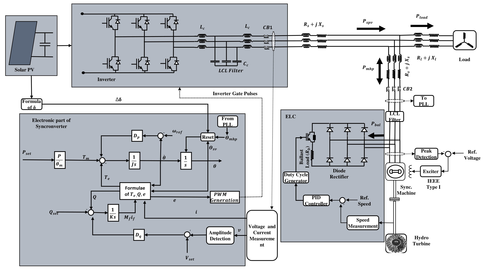

# Power_management_solar_mhp

The simulink files used in the article title "Power Sharing in Solar PV: Microhydro Hybrid System Using Power Angle Control Strategy"
Consider citation:

Neupane, D., Gurung, S., Neupane, S. et al. 
Power Sharing in Solar PV: Microhydro Hybrid System Using Power Angle Control Strategy. 
J Control Autom Electr Syst (2022).
 https://doi.org/10.1007/s40313-022-00943-w
